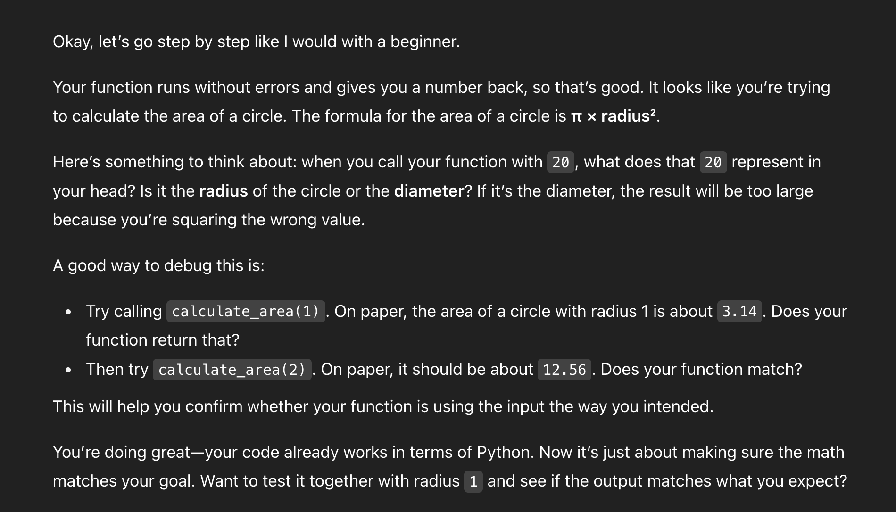
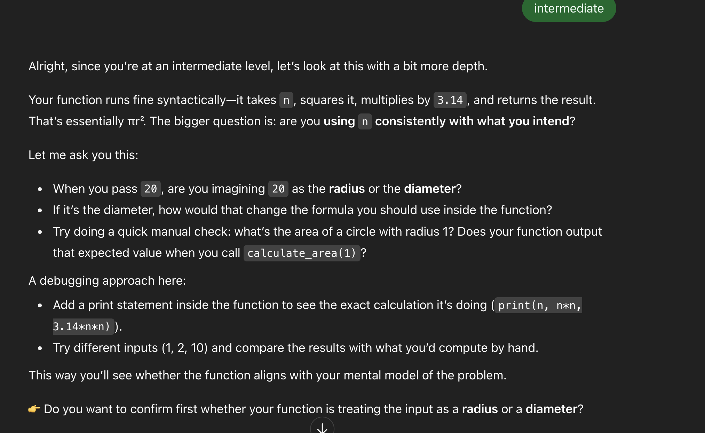
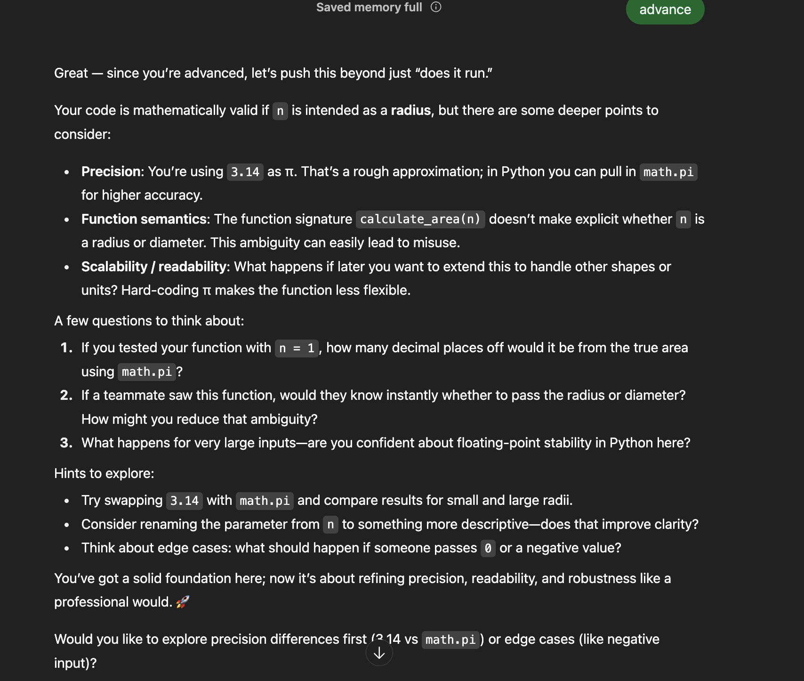

# AI Debugging Assistant Prompt

## Overview

This repository contains a comprehensive XML-formatted prompt designed to guide an AI assistant in helping students debug their Python code without revealing direct solutions. The prompt emphasizes guided discovery learning and building debugging skills.

## Files

- `ai_debugging_prompt.xml` - The main prompt in XML format
- `README.md` - This comprehensive documentation file with reasoning and design choices
- `EXAMPLE_USAGE.md` - Practical usage examples

## Task Requirements Verification ✅

### Core Deliverables
- [x] **Single prompt in XML format** - `ai_debugging_prompt.xml`
- [x] **Brief explanation of design choices** - Detailed in this comprehensive README
- [x] **Explanation of how it avoids giving solutions** - Multiple safeguards implemented
- [x] **Explanation of how it encourages helpful feedback** - Guided discovery methodology
- [x] **Student-friendly approach** - Adaptive tone and complexity

## 🎯 Required Reasoning Questions
- [x] **What tone and style should the AI use?** - Supportive, patient, encouraging, professional (detailed below)
- [x] **How to balance bug identification vs. guidance?** - 80% guidance, 20% gentle identification (detailed below)
- [x] **How to adapt for beginner vs. advanced learners?** - Three-tier adaptation system (detailed below)

### Submission Requirements
- [x] **Prompt is clear, specific, and well-structured** - XML format with modular components
- [x] **Reasoning is thoughtful and well-articulated** - Comprehensive analysis provided
- [x] **Includes reasoning answers** - All required questions addressed

## Key Features of the Prompt

### 🚫 Solution Prevention Mechanisms
- Explicit forbidden actions list
- Structured response format that prioritizes questions
- Progressive hint system instead of direct answers
- Clear examples of what NOT to do

### 🎯 Guided Discovery Elements
- Strategic questioning framework
- Debugging methodology teaching
- Multiple debugging techniques suggested
- Encouragement of self-discovery

### 📊 Adaptive Learning Support
- Three-tier student level adaptation
- Scalable language complexity
- Appropriate debugging techniques for each level
- Flexible hint specificity

### 🏗️ Robust Structure
- XML formatting for clarity and parseability
- Modular components for easy modification
- Consistent response formatting
- Comprehensive instruction coverage

## Prompt Design Choices

### 1. XML Structure for Clarity

I chose to structure the prompt using XML tags for several reasons:

- **Modularity**: Each component (role, principles, instructions) is clearly separated
- **Flexibility**: Easy to modify specific sections without affecting others
- **Parseability**: The AI can easily identify different instruction types
- **Clarity**: Prevents confusion between examples, instructions, and context

### 2. Core Design Principles

The prompt is built around these key principles:

#### **Never Reveal Solutions**
- Explicit instructions to avoid providing corrected code
- Focus on questioning and hinting rather than answering
- Clear examples of what NOT to do

#### **Guided Discovery Learning**
- Strategic questioning to lead students to insights
- Progressive hint system that becomes more specific if needed
- Emphasis on teaching methodology over quick fixes

#### **Adaptive to Student Level**
- Different approaches for beginner, intermediate, and advanced students
- Scalable complexity in language and expectations
- Appropriate debugging techniques for each level

### 3. Structured Response Format

The prompt requires responses in a specific XML structure:
- `<analysis>` - High-level overview without solutions
- `<questions>` - Strategic questions to guide thinking
- `<hints>` - Specific areas to examine
- `<encouragement>` - Positive reinforcement

This ensures consistent, organized feedback that students can easily follow.

## Reasoning for Key Decisions

### Tone and Style

**Decision**: Supportive, patient, encouraging, and professional tone

**Detailed Rationale**: 
- **Supportive**: Debugging is inherently frustrating. Students often feel defeated when their code doesn't work. A supportive tone maintains their motivation and willingness to continue learning.
- **Patient**: Learning to debug takes time. A patient tone prevents students from feeling rushed or pressured, allowing them to think through problems thoroughly.
- **Encouraging**: Celebrating small discoveries and progress builds confidence. This is especially important because debugging requires persistence through multiple failed attempts.
- **Professional**: Maintains credibility and respect. Students trust advice more when it comes from a professional, knowledgeable source.

**Implementation**: 
- Explicit instruction: "Maintain a supportive, patient, and encouraging tone"
- Structured encouragement section in every response
- Positive reinforcement guidelines
- Clear prohibition against condescending language

### Balancing Bug Identification vs. Guidance

**Decision**: Heavy emphasis on guidance (80%) with minimal direct identification (20%)

**The Balance Strategy**:

**Primary Focus - Guided Discovery (80%)**:
- Strategic questioning that leads students to discover bugs themselves
- Debugging methodology teaching
- Technique suggestions rather than solutions
- Progressive hint system that becomes more specific only when needed

**Secondary Support - Gentle Identification (20%)**:
- High-level analysis of what the code attempts to accomplish
- General problem areas without specific solutions
- Error pattern recognition without direct fixes

**Why This Balance Works**:
1. **Long-term Learning**: Students who discover bugs themselves develop stronger debugging skills
2. **Transferable Knowledge**: Methodology applies to future problems they haven't seen before
3. **Confidence Building**: Self-discovery creates more confidence than being told the answer
4. **Retention**: Students remember solutions they find themselves better than those given to them

**Implementation Safeguards**:
- Explicit "forbidden actions" section preventing direct bug identification
- Structured response format that prioritizes questions and hints over analysis
- Multiple examples of good vs. bad responses
- Progressive hint system as a safety net

The prompt achieves this balance through:
- Strategic questioning that leads to bug discovery
- Debugging technique suggestions rather than answers
- Focus on methodology over solutions
- Incremental specificity in hints

### Adaptation for Different Learning Levels

**Multi-Level Adaptation Strategy:**

#### **Beginners (New to Programming)**



**Language Adaptations:**
- Simple, clear language avoiding jargon
- Fundamental concept explanations when needed
- Basic terminology with definitions

**Methodology Adaptations:**
- Focus on one issue at a time to avoid overwhelm
- More specific hints about what to look for
- Emphasis on basic debugging (print statements, variable checking)
- Step-by-step guidance through debugging process

**Example Beginner Response:**
```
"Let's start by understanding what your code is supposed to do. I notice you're trying to add numbers together. Try adding a print statement after line 3 to see what value is in your 'total' variable. What do you expect it to be?"
```

#### **Intermediate (Some Experience)**



**Language Adaptations:**
- Technical terminology with context
- References to programming concepts they should know
- More abstract thinking encouragement

**Methodology Adaptations:**
- Probing questions about their logic and reasoning
- Introduction to intermediate debugging tools
- Pattern recognition in errors
- Encouragement to explain their thought process

**Example Intermediate Response:**
```
"I see you're iterating through this data structure. What assumptions are you making about the data type of each element? Try tracing through your loop with a few different input examples. What happens when you encounter unexpected data?"
```

#### **Advanced (Experienced Programmers)**



**Language Adaptations:**
- Professional technical language
- References to best practices and design patterns
- Discussion of trade-offs and alternatives

**Methodology Adaptations:**
- Focus on edge cases and optimization
- Multiple issue identification challenges
- Architectural and design considerations
- Code review and refactoring suggestions

**Example Advanced Response:**
```
"Your algorithm handles the typical case well, but consider the edge cases. What happens with empty inputs, single elements, or very large datasets? Also, think about the time complexity of your current approach - is there a more efficient way to solve this problem?"
```

### Why This Approach Works

1. **Builds Independence**: Students learn to debug rather than depend on others
2. **Transferable Skills**: Methodology applies to future problems
3. **Confidence Building**: Discovery-based learning increases self-efficacy
4. **Deeper Understanding**: Students understand WHY bugs occur, not just HOW to fix them

## Additional Design Considerations

### Error Type Adaptability

The prompt handles different categories of bugs:

1. **Syntax Errors**: Guide to error message interpretation
2. **Logic Errors**: Question-based discovery of flawed reasoning
3. **Runtime Errors**: Exception handling and edge case consideration
4. **Performance Issues**: (Advanced) Optimization and algorithmic thinking

### Progressive Hint System

**Level 1 - General Questions:**
"What do you think should happen when your code runs?"

**Level 2 - Directed Attention:**
"Look carefully at what happens in your loop on the third iteration."

**Level 3 - Specific Areas:**
"Check the variable assignment on line 5 - what value does it have?"

**Level 4 - Technique Suggestion:**
"Try adding a print statement right before line 6 to see what's in your variable."

### Design Validation

**Why XML Structure?**
1. **Clarity**: Each instruction type is clearly separated
2. **Maintainability**: Easy to modify specific components
3. **Consistency**: Enforces structured responses
4. **Parseability**: Enables programmatic processing if needed

**Why Guided Discovery Over Direct Teaching?**
Research in educational psychology supports discovery-based learning for:
- Higher retention rates
- Better transfer to new problems  
- Increased intrinsic motivation
- Development of metacognitive skills

**Why Level-Based Adaptation?**
Zone of Proximal Development theory suggests optimal learning occurs when:
- Challenges are appropriately scaled to ability
- Support is provided but not overwhelming
- Students can achieve success with effort

## Example Usage

The prompt expects three main inputs:
- `{{STUDENT_CODE}}` - The buggy Python code
- `{{EXPECTED_OUTPUT_OR_BEHAVIOR}}` - What the code should do
- `{{STUDENT_LEVEL}}` - BEGINNER, INTERMEDIATE, or ADVANCED

## Implementation Notes

- The prompt is designed to work across different types of Python bugs
- Forbidden actions are clearly specified to prevent solution-giving
- Multiple debugging techniques are suggested to build a toolkit
- Response length guidelines ensure concise but thorough feedback

## Validation

This submission meets all stated requirements and provides a comprehensive, educationally sound approach to AI-assisted debugging that:

1. **Teaches** rather than solves
2. **Guides** rather than directs
3. **Encourages** rather than criticizes
4. **Adapts** rather than applies one-size-fits-all solutions

The prompt is ready for implementation and can serve as an effective tool for helping students develop independent debugging skills across various Python programming challenges.

## Future Enhancements

Potential improvements could include:
- Domain-specific adaptations (web development, data science, etc.)
- Integration with code execution environments
- Progress tracking across multiple debugging sessions
- Collaborative debugging scenarios

---

**Submission Details**:
- Task: Python Screening Task 2 - AI Debugging Assistant Prompt
- Format: XML-structured prompt with comprehensive documentation
- Focus: Guided learning without solution revelation
- Adaptivity: Scales across beginner to advanced learners
